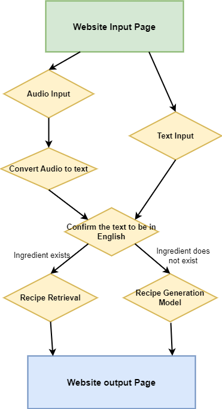

# recipe_retrieval_2.0

IR recipe retrieval from ingredients

## Installation

```bash
$ pip install git+https://github.com/jg2185/Recipe-Retrieval-2.0.git
```
## Contributor

`recipe_retrieval_2.0` was created by Jess Godes, Linda Ding, Yi Luo, Chuyun Kuang.

## Usage

Here's a usage guide for Recipe Generator website:

### Accessing the Website

* Open the website by running `python website/app.py', followed by running `http://127.0.0.1:5000` in your local website. 

### Using the Recipe Generator

1. **Input Ingredients:**
   * In the field labeled "Ingredients that you have separated by commas," enter the ingredients you have on hand. List each ingredient separated by a comma.
   * In the field labeled "Ingredients that you don't like, separated by commas," list any ingredients you wish to avoid in recipes, separated by commas.

2. **Submit Ingredients:**
*  Once you have inputted your ingredients, click the "Submit Ingredients" button to process your input.

3. **Voice Input:**
* If you prefer to use voice commands, click the "Start voice input" button and clearly state the ingredients you have and those you wish to avoid. Make sure your device's microphone is enabled and functioning.

4. **Viewing Recipes:**
* After submitting your ingredients, scroll down to the "Recipe Results" section to view the suggested recipes that match your input criteria. This section will display recipes using the ingredients you have and avoiding those you dislike.

### Tips for Optimal Use
* Ensure all ingredients are spelled correctly to improve recipe matching accuracy.
* Use generic names for ingredients to increase the likelihood of finding suitable recipes.

## Contributing

Interested in contributing? Check out the contributing guidelines. Please note that this project is released with a Code of Conduct. By contributing to this project, you agree to abide by its terms.

## License

`recipe_retrieval_2.0` was created by Jess Godes, Linda Ding, Yi Luo, Chuyun Kuang. It is licensed under the terms of the MIT license.

## Credits

`recipe_retrieval_2.0` was created with [`cookiecutter`](https://cookiecutter.readthedocs.io/en/latest/) and the `py-pkgs-cookiecutter` [template](https://github.com/py-pkgs/py-pkgs-cookiecutter).

## Project Structure
By default, the project assumes the following directory structure:

    +-- data                                # Files collected from https://eightportions.com/datasets/Recipes/
    ¦   +-- recipes_raw_nosource_ar         # Recipe collected from http://allrecipes.com/
    ¦   +-- recipes_raw_nosource_epi        # Recipe collected from http://www.epicurious.com/
    ¦   +-- recipes_raw_nosource_fn         # Recipe collected from http://www.foodnetwork.com/
    ¦
    ¦
    +-- Input_Processing                
    ¦   +-- main_input_processing.py        # Useful for processing input data transferd from website
    ¦   +-- text_processing.py              # Useful for processing text data
    ¦   +-- speech_processing.py            # Useful for processing audio data
    ¦
    ¦
    +-- src                                 
    ¦   +-- recipe_retrieval_2.0           
    ¦   ¦   +-- utils                       
    ¦   ¦   ¦   +-- preprocess.py           # Useful for process dataset stored in data/ file
    ¦   ¦   ¦   +-- recipe_searcher.py      # Useful for generating recipes 
    ¦   ¦   ¦
    ¦   ¦   +-- recipe_retrieval_2.0.py     # Useful for code tie together
    ¦
    ¦
    +-- tests
    ¦   +-- test_data.json
    ¦   +-- test_recipe_retrieval_2.0.py
    ¦
    ¦
    +-- website
    ¦   +-- receive.html                    # Useful for displaying Recipe Generator 
    ¦   +-- script.js                       # Useful for connecting website and codes 
    ¦   +-- plot                            # background plot of the website

## Project Workflow
To better understand the structure of the project, please check the flollowing program architecture.


